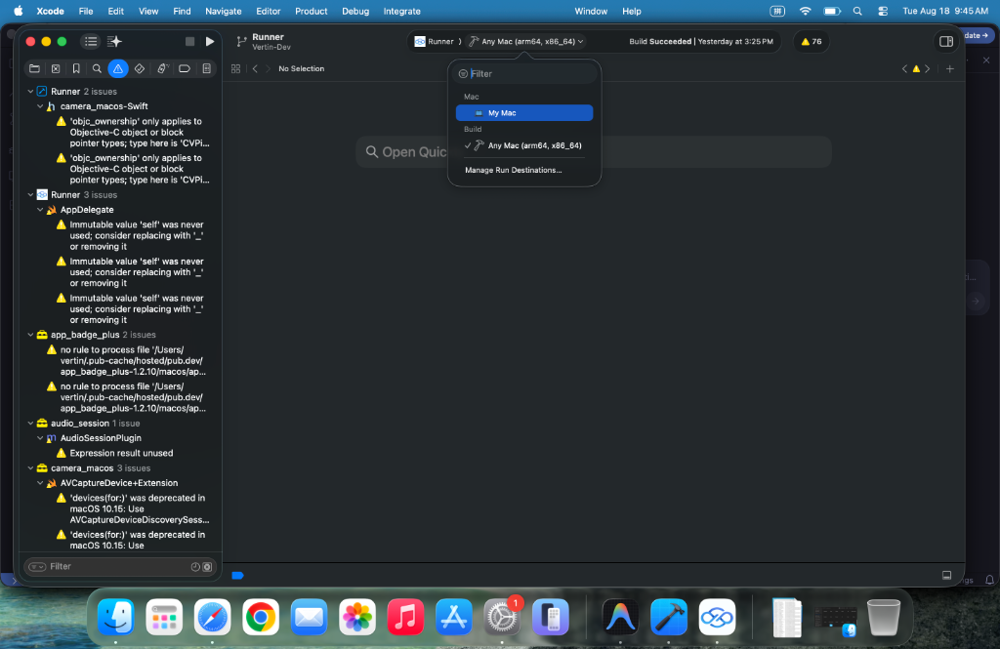
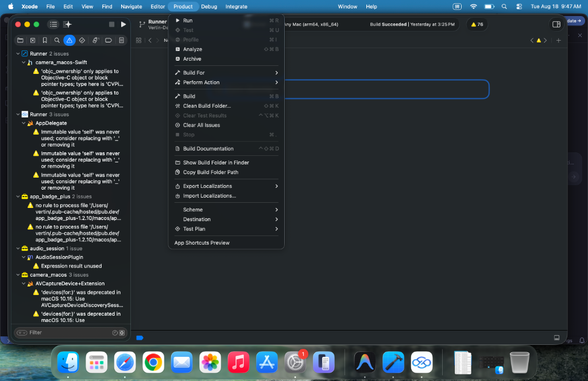
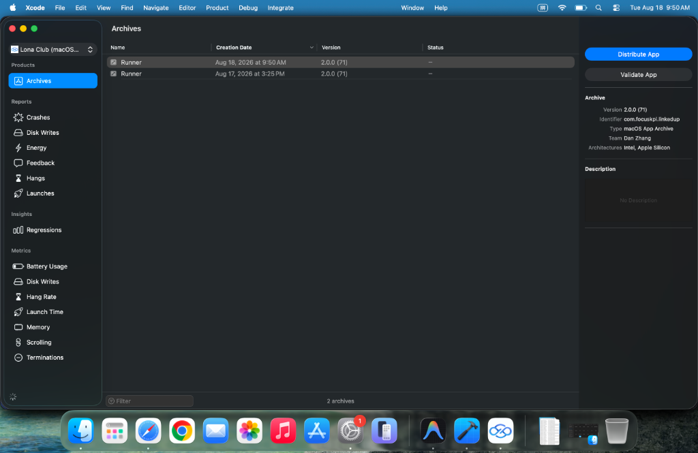
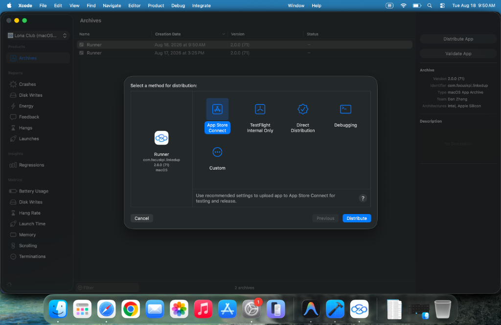
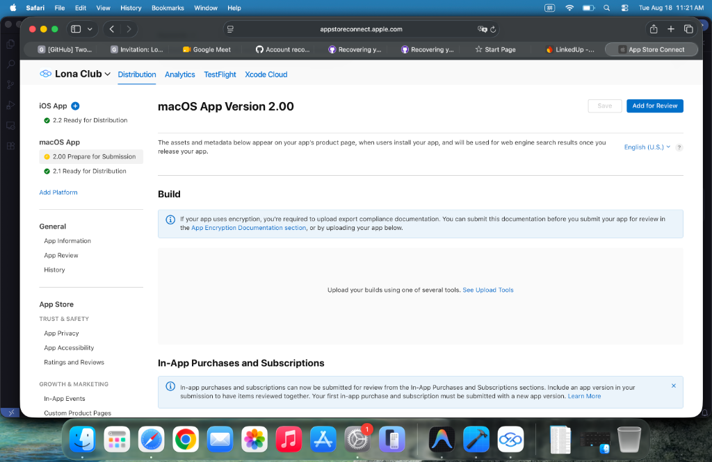

# 📱 Xcode App Store 上传指南

> **适用对象**：新入职开发人员  
> **适用平台**：iOS & macOS  
> **开发者账号**：Focus KPI  
> **最后更新**：2026-08-18

---

## 目录

1. [前置准备：更新版本号](#step-1-更新版本号)
2. [配置 Xcode 并构建项目](#step-2-配置-xcode-并构建项目)
3. [Archive 打包](#step-3-archive-打包)
4. [Distribute 发布到 App Store](#step-4-distribute-发布到-app-store)
5. [在 App Store Connect 提交审核](#step-5-在-app-store-connect-提交审核)
6. [常见问题与注意事项](#常见问题与注意事项)

---

## Step 1：更新版本号

> [!IMPORTANT]
> 确保新版本已完成全部功能测试且无严重 Bug，再开始发布流程。

在确认新版本测试无误后，通知你的 **AI Agent**（Cursor、Antigravity、Claude Code、Codex 等均可）帮你更新版本号。

### 关键要求

- **iOS 和 macOS 的版本号需要分别更新**，不能混用同一个配置。
- 让 AI 确认以下两处版本号已正确递增：
  - `ios/Runner/Info.plist` 中的 `CFBundleShortVersionString`（版本号）和 `CFBundleVersion`（Build 号）
  - `macos/Runner/Info.plist` 中的 `CFBundleShortVersionString`（版本号）和 `CFBundleVersion`（Build 号）

### 示例指令

```
请帮我将 iOS 版本号从 2.1 更新到 2.2，Build 号从 70 更新到 71。
同时将 macOS 版本号从 2.0.0 更新到 2.1.0，Build 号从 71 更新到 72。
```

---

## Step 2：配置 Xcode 并构建项目

### 2.1 打开对应平台的 Xcode 工程

分别打开 **iOS** 和 **macOS** 的 Xcode 工程文件。可以在 Xcode 窗口顶部的 **工具栏 (Toolbar)** 上确认当前打开的是哪个平台的项目。

### 2.2 选择正确的 Build Destination

这一步非常关键，**务必选择正确的目标设备**：

| 平台 | 目标设备选择 |
|------|-------------|
| **macOS** | 选择 **Any Mac (arm64, x86_64)** |
| **iOS** | 选择 **Any iOS Device** |

**📸 参考截图：macOS 项目选择 Any Mac**

> 如下图所示，点击 Xcode 顶部工具栏中 Scheme 右侧的设备选择器，在弹出菜单中选择 **Any Mac (arm64, x86_64)**。
> 
> 

### 2.3 处理编译警告与错误

构建过程中，左侧导航栏可能会显示各种问题提示：

| 类型 | 图标 | 处理方式 |
|------|------|---------|
| ⚠️ 黄色警告 | 黄色三角形 | **可以忽略**，不影响打包 |
| 🔴 红色错误 | 红色圆形 | **必须处理** — 截图提交给 AI 协助修复 |

### 2.4 等待构建完成

当工具栏显示 **"Build Succeeded"** 时，表示构建成功，可以进入下一步。

---

## Step 3：Archive 打包

### 3.1 执行 Archive

1. 确认工具栏显示 **Build Succeeded**。
2. 在 Xcode 顶部菜单栏中，点击 **Product**。
3. 在下拉菜单中选择 **Archive**。

**📸 参考截图：Product → Archive**

> 如下图所示，在 Xcode 菜单栏选择 Product > Archive，Xcode 将会开始打包程序。
>
> 

### 3.2 等待打包完成

- Archive 打包过程大约需要 **5 分钟**左右。
- 打包过程中请勿关闭 Xcode 或进行其他操作。
- 打包完成后，会自动弹出 **Organizer** 窗口，显示所有已打包的 Archive 列表。

**📸 参考截图：Archive 完成后的 Organizer 窗口**

> 打包成功后会弹出 Organizer，如下图所示，你可以看到刚刚打包的 Archive 及其版本号。
>
> 

---

## Step 4：Distribute 发布到 App Store

### 4.1 开始分发

在 Organizer 窗口中：

1. **选中**刚刚打包完成的最新 Archive（注意看 Creation Date 确认是最新的）。
2. 点击右侧的 **"Distribute App"** 按钮。

### 4.2 选择分发方式

在弹出的分发方式选择窗口中，你可以根据需求选择：

| 分发方式 | 用途 | 说明 |
|---------|------|------|
| **App Store Connect** | 正式发布 | 发布到 App Store 供用户下载 |
| **TestFlight Internal Only** | 内部测试 | 仅供内部测试人员使用 |
| **Direct Distribution** | 直接分发 | 绕过 App Store 直接分发 |
| **Debugging** | 调试用途 | 用于调试目的 |

> [!TIP]
> - 选择 **App Store Connect** 可以同时用于正式发布和 TestFlight 测试。
> - 如果只想发布测试版本，也可以选择 **TestFlight Internal Only**。

**📸 参考截图：选择分发方式**

> 如下图所示，选择 App Store Connect 后点击 Distribute 即可开始上传。
>
> 

选择好后，点击右下角的 **"Distribute"** 按钮开始上传。

### 4.3 上传结果处理

| 结果 | 说明 |
|------|------|
| ✅ 上传成功 + ⚠️ 黄色警告 | **正常**，表示已上传成功，黄色警告可忽略 |
| ❌ 上传失败 + 🔴 红色错误 | **需要处理** — 截图提交给 AI 协助解决 |

---

## Step 5：在 App Store Connect 提交审核

### 5.1 登录 App Store Connect

1. 打开浏览器，访问 [App Store Connect](https://appstoreconnect.apple.com)。
2. 使用 **Focus KPI 的开发者账号** 登录。

### 5.2 等待 Build 处理完成

> [!NOTE]
> 在 Xcode 成功 Distribute 后，需要等待大约 **20-30 分钟**，Apple 服务器才会处理完毕你上传的 Build。

### 5.3 选择 Build 并提交审核

以 **macOS 发布**为例：

1. 在左侧导航栏中，找到 **macOS App** 下对应的版本（如 `2.00 Prepare for Submission`）。
2. 在页面中部的 **Build** 区域，找到并选中你刚刚上传的版本。
3. 填写 **本版本更新内容**（What's New in This Version）。
4. 点击右上角的 **"Save"** 保存。
5. 点击 **"Add for Review"** 提交审核。

**📸 参考截图：App Store Connect 提交页面**

> 如下图所示，在 Build 区域选择上传的版本，填写更新说明后提交审核。
>
> 

### 5.4 等待审核通过

> [!IMPORTANT]
> 提交审核后，Apple 审核团队通常需要 **约 2 天** 的时间完成审核。审核通过后，你会收到通知邮件，新版本将正式上架 App Store。

---

## 常见问题与注意事项

### ❓ Q1：iOS 和 macOS 可以同时打包上传吗？

可以，但建议**分开操作**，一个平台完成全部流程后再操作另一个平台，避免混淆。

### ❓ Q2：Archive 菜单是灰色的，无法点击？

确保你已选择正确的 Build Destination：
- macOS 项目需选择 **Any Mac**
- iOS 项目需选择 **Any iOS Device**
- 不要选择模拟器 (Simulator)

### ❓ Q3：上传时提示签名错误？

截图给 AI Agent 处理。常见原因包括：
- 证书过期
- Provisioning Profile 不匹配
- 开发者账号权限不足

### ❓ Q4：App Store Connect 中看不到上传的 Build？

- 确认 Distribute 步骤已成功完成（无红色错误）。
- 请耐心等待 **20-30 分钟**，Apple 服务器需要时间处理。
- 检查注册邮箱，Apple 有时会发送处理失败的邮件通知。

### ❓ Q5：审核被拒绝了怎么办？

查看 Apple 给出的拒绝原因，修复问题后重新上传并提交审核。常见拒绝原因可交给 AI Agent 分析处理。

---

## 完整流程速览

```
测试通过 → AI 更新版本号 → Xcode Build → Archive 打包（~5min）
    → Distribute 上传 → App Store Connect 选择 Build（等待~30min）
    → 填写更新内容 → Add for Review → 等待审核（~2天）→ 🎉 上架成功
```

---

> **Tips**: 遇到任何红色报错，第一时间截图发送给你的 AI Agent（Cursor / Antigravity / Claude Code / Codex 等），它们能快速帮你定位和解决大部分构建与上传问题。
